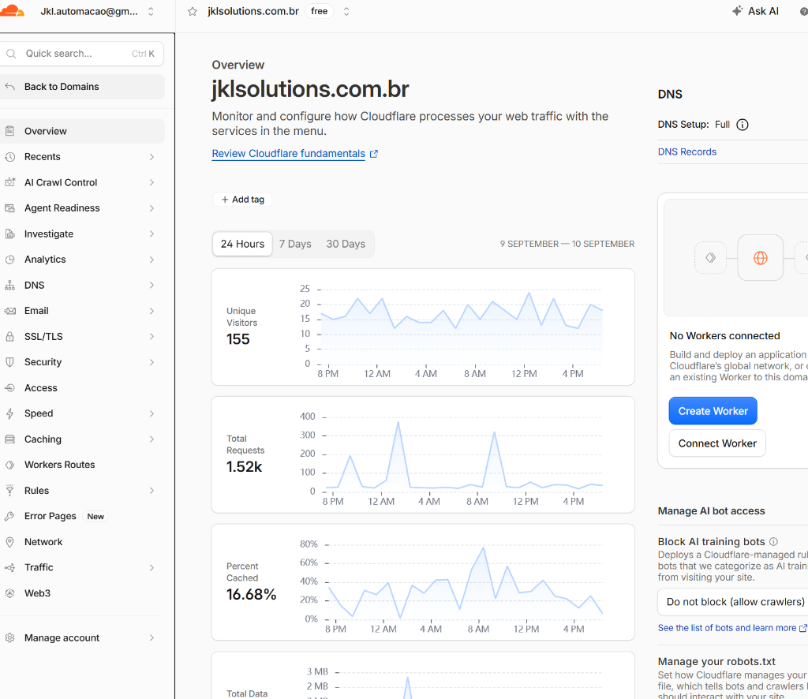
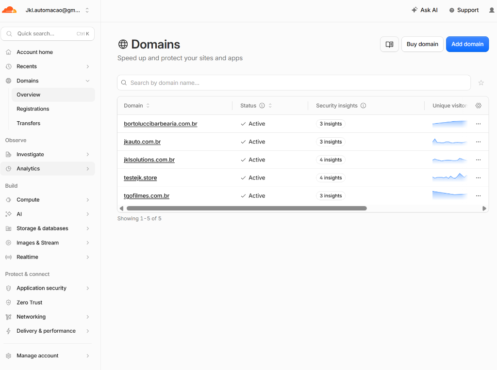
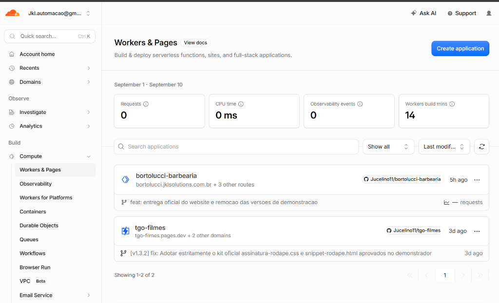
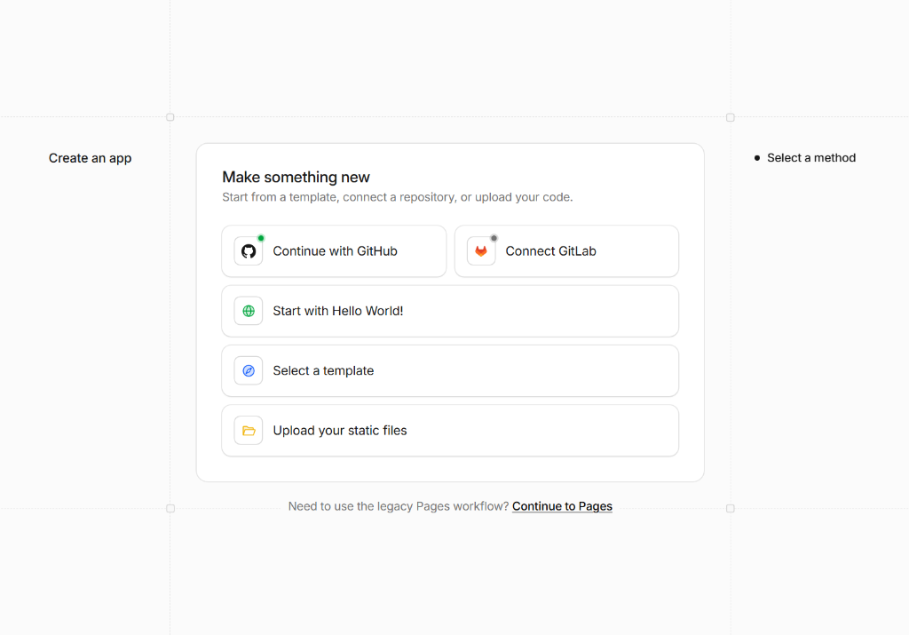
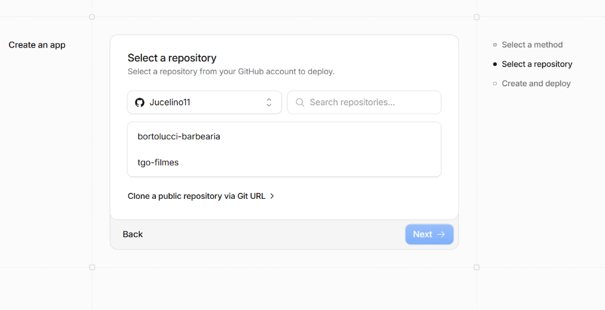
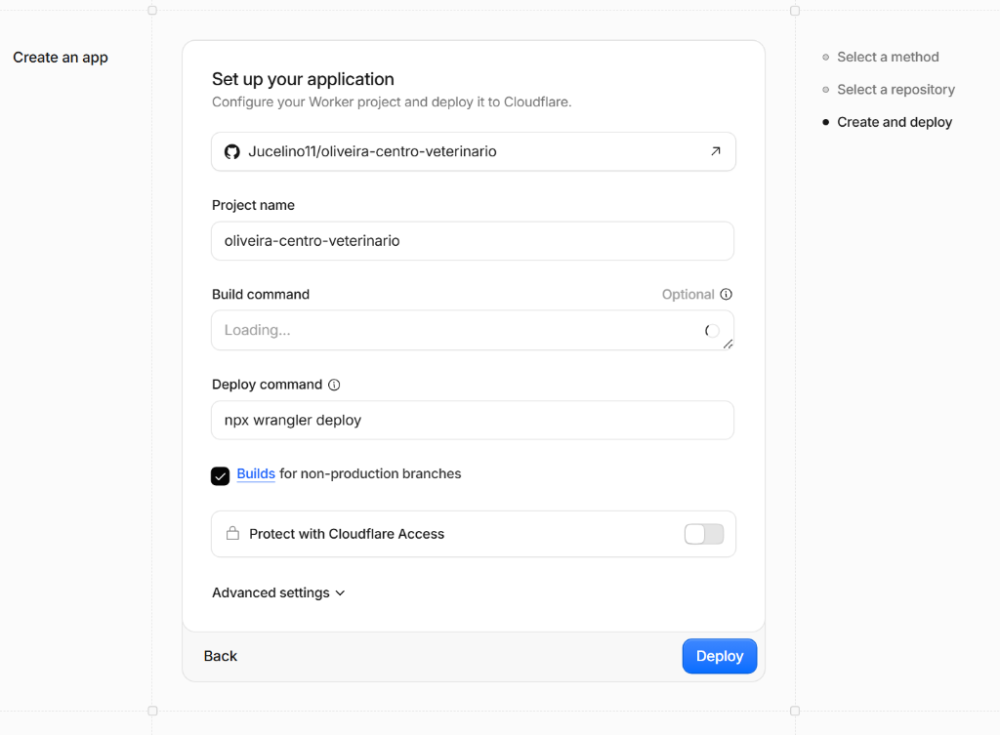
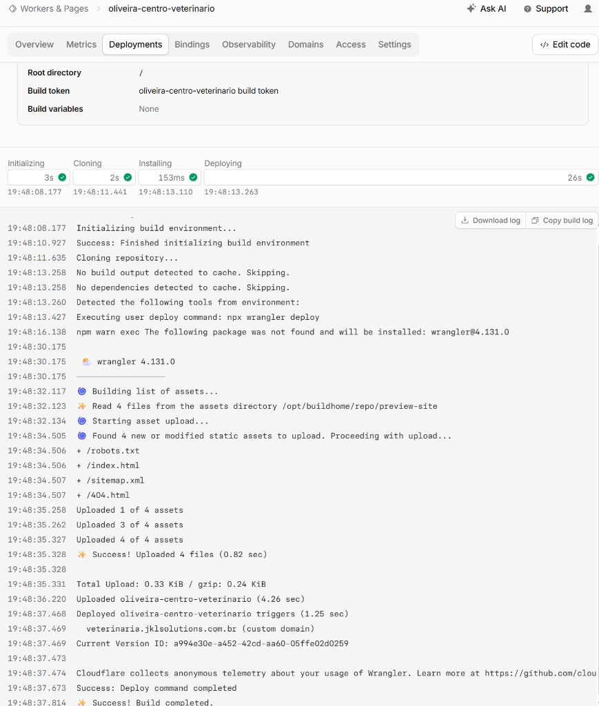

# Procedimento Operacional Padrão (POP) — JKL Solutions

## Criar um site para teste do cliente na Cloudflare (Perfil jkl.automacao@gmail.com): na página jklsolutions.com.br

> **Objetivo:** Guia passo a passo com evidências visuais para subir sites institucionais de homologação e teste para novos clientes da JKL Solutions, utilizando a infraestrutura do GitHub e Cloudflare Workers / Pages.

---

### Etapa 1: Preparação dos Arquivos Locais & Repositório no GitHub
1. Ter na pasta do projeto os arquivos essenciais:
   - `preview-site/` (pasta com `index.html`, `404.html`, `robots.txt`, `sitemap.xml`)
   - `wrangler.json` e `wrangler.toml` (apontando para a rota custom domain `nomedocliente.jklsolutions.com.br`)
2. Criar e subir no GitHub oficial `Jucelino11`:
   ```bash
   git init
   git add .
   git commit -m "feat: landing page institucional"
   gh repo create oliveira-centro-veterinario --public --source=. --remote=origin --push
   ```

---

### Etapa 2: Acesso ao Painel da Cloudflare e Caminho Correto do "Workers & Pages"
> ⚠️ **Problema frequente evitado:** Se você estiver dentro da tela de um domínio individual (`jklsolutions.com.br`), o menu lateral não mostra *Workers & Pages*.

1. Clique em **`< Back to Domains`** (no topo esquerdo) para voltar ao painel geral da conta.
   
2. No menu lateral principal esquerdo, procure o bloco **Build**:
   - Clique em **Compute** ➔ **Workers & Pages**.
   

---

### Etapa 3: Criar Nova Aplicação (Sem Apagar Nada Antigo!)
> ⚠️ **Regra de ouro:** Cada cliente tem o seu próprio projeto independente. Nunca apague nem troque o nome de projetos em produção (como `bortolucci-barbearia`), pois eles estão servindo os domínios oficiais ativos.

1. Na tela de **Workers & Pages**, clique no botão azul no canto superior direito: **`Create application`**.
   

---

### Etapa 4: Selecionar Método de Deploy (GitHub)
1. Na tela *"Make something new"*, clique em **`Continue with GitHub`** (com o status verde de conectado).
   

---

### Etapa 5: Selecionar o Repositório do Cliente
1. Na tela *"Select a repository"*, localize o repositório criado para o cliente (ex: `oliveira-centro-veterinario`).
   

#### 💡 Se o repositório novo não aparecer na listinha de imediato:
* **Opção 1:** Digite `oliveira` no campo **Search repositories...**;
* **Opção 2:** Clique no dropdown **`Jucelino11`** para selecionar e autorizar o novo repositório na Cloudflare;
* **Opção 3:** Clique no link logo abaixo: **`Clone a public repository via Git URL >`** e cole a URL direta:
  `https://github.com/Jucelino11/oliveira-centro-veterinario`

---

### Etapa 6: Configuração da Aplicação e Deploy
1. Na tela *"Set up your application"*:
   - **Project name:** Mantém o nome padrão (ex: `oliveira-centro-veterinario`);
   - **Build command:** Deixa em branco (opcional);
   - **Deploy command:** `npx wrangler deploy` (automático);
2. Clique no botão azul: **`Deploy`**.
   

---

### Etapa 7: Publicação & Custom Domain Ativo
1. A Cloudflare compila e faz o upload dos arquivos estáticos diretamente do GitHub.
2. Como o `wrangler.toml` continha a rota `custom_domain = true`, o subdomínio da JKL Solutions é ativado imediatamente:
   - **URL Oficial de Homologação:** `https://veterinaria.jklsolutions.com.br`
   - **Status:** `HTTP 200 OK` (com certificado SSL e CDN Cloudflare no Brasil).
   

